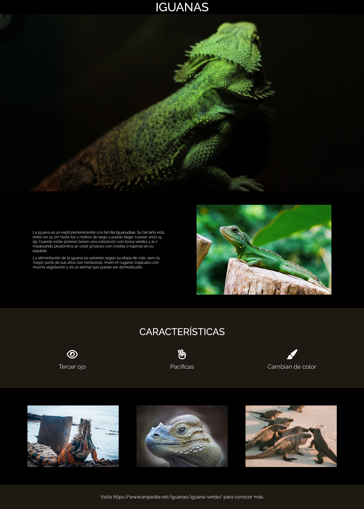

# Desafío 3 - Iguana Page

¡Hola! 👋 En este desafío he aplicado mis conocimientos de posicionamiento en CSS para construir la página web "Iguana Page". He combinado conceptos de flex y unidades anteriores para lograr un diseño atractivo y funcional. A continuación, te contaré más sobre mi proyecto.

## Descripción del Proyecto 🦎

En este desafío, he construido un landing page llamado "Iguana Page" utilizando técnicas avanzadas de posicionamiento en CSS. La página sigue una estructura clara y presenta información sobre las características de las iguanas, acompañada de imágenes cautivadoras.

## Resultado Final 🎉

Aquí está un vistazo al resultado final de mi proyecto:

### Escritorio 💻

### Contenido Principal 🌐
El contenido principal incluye información sobre las iguanas y una imagen destacada.

### Sección de Características 🌈
La sección de características destaca tres aspectos importantes de las iguanas, representados con íconos de Font Awesome.

### Galería de Imágenes 📸
La galería de imágenes muestra diferentes vistas de las fascinantes iguanas.

### Footer 📚
En el footer, he incluido un enlace a una fuente adicional de información sobre las iguanas.

## Experiencia del Desarrollo 🛠️

Durante este proyecto, he aplicado flexibilidad en el diseño, utilizando flexbox y unidades de medida adecuadas. También he incorporado íconos de Font Awesome para mejorar la presentación visual.

